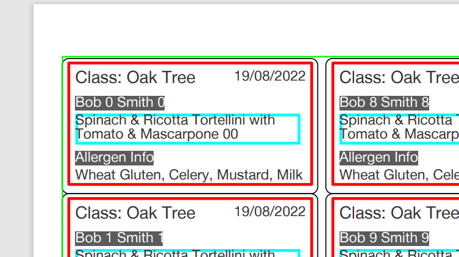

# label-generator

## Label-generation as a service.

Currently hard-coded for a single label-type:

```
export type LabelInfo = {
    className: string
    date: string
    firstName: string
    lastName: string
    description: string
    allergenInfo: string
}
```

Early support for multiple label-sheets:

```
export type LabelSheetSpec = {
    paper: {
        width_mm: number
        height_mm: number
        margins_mm: {
            top: number
            right: number
            bottom: number
            left: number
        }
    }

    label: {
        width_mm: number
        height_mm: number
        horizontalCount: number
        verticalCount: number
        cornerRadius_mm: number
        horizontalGap_mm: number
        verticalGap_mm: number
    }
}
```

## Generate a PDF

A PDF ready for printing may be generated by sending a two-part JSON blob to '/generate-labels':

```
{ "labelInfos": [
  {
    "className": "Oak Tree",
    "date": "19/08/2022",
    "firstName": "Bob 0",
    "lastName": "Smith 0",
    "description": "Spinach & Ricotta Tortellini with Tomato & Mascarpone 0",
    "allergenInfo": "Wheat Gluten, Celery, Mustard, Milk"
  },
  // etc...
  {
    "className": "Oak Tree",
    "date": "19/08/2022",
    "firstName": "Bob 99",
    "lastName": "Smith 99",
    "description": "Spinach & Ricotta Tortellini with Tomato & Mascarpone 99",
    "allergenInfo": "Wheat Gluten, Celery, Mustard, Milk"
  }],

  "debug": {
	  "labels": true,
	  "pageEdge": false,
	  "labelBoxes": false,
	  "wrapBoxes": false
  }
}
```

## Debug

#### `debug`

is optional but super-useful whilst creating your layout algorithm. Once stabilized, removing the debug key results in PDFs with only the items (text, graphics) to be printed.

#### `debug.labels`

generates a combined PDF with a lower-layer of your label-outlines and an upper-layer of your ongoing attempts to render label information properly.

#### `debug.pageEdge`

shows a (lime-green in the image below) hilight at the margin of the label document - the margin serves as the anchor for the coordinate system within the document and thus also anchors the scaling between it and the millimetre-coordinate system used in the LabelSheetSpec and the label-layout algorithm - good to know if it's misaligned.

#### `debug.labelBoxes`

similar to debug.pageEdge - shows a (red in the image) hilight which should sit snugly inside the borderRadius of your label-outlines and acts as a visual anchor for the coordinate system inside the label

`debug.wrapBoxes` - shows an outline (cyan in the image) around boxes used to wrap longer text fields

### Label debug-boxes



## Extensibility

With minor modifications is should be possible to allow `LabelSpecSheet`s to be registered which may then be referenced when registering:

```
[
  LabelInfo,
  LayoutAlgorithem,
  LabelSpecSheet
]
```

triples.

This would allow the service to handle issues relating to:

-   coordinate-mapping,
-   iterating through the labels,
-   paging,
-   PDF-generation

and allow easy extension.

A layout algorithm is a small function which receives:

-   coordinates for the top-left of the label to be rendered
-   the dimensions of the label
-   drawing functions, e.g. box, text
-   a `LabelInfo` with the information to be displayed

All units are in mm to allow easy label-creation
